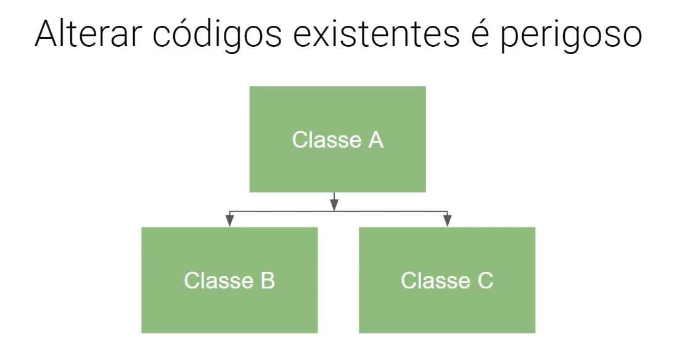
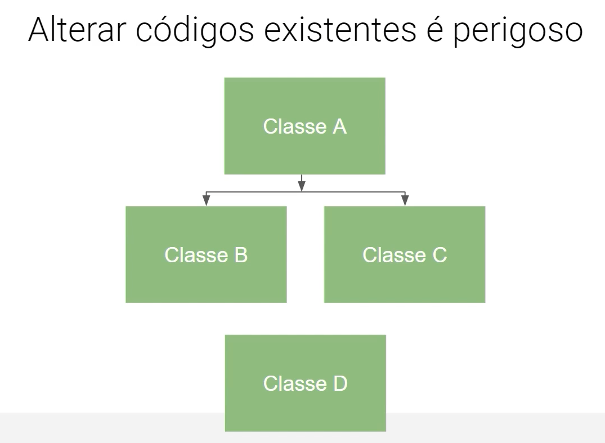
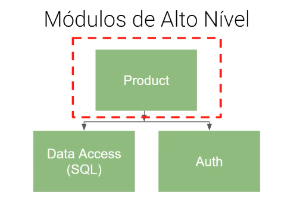
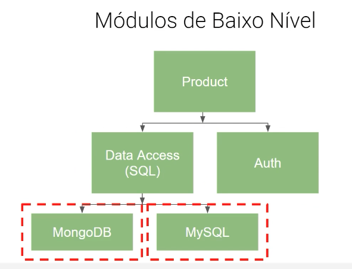

# SOLID

## S - Single Responsability Principle (SRP)

### Princípio da Responsabilidade única

_"Nunca deve haver mais de um motivo pra uma classe mudar"_

Cada classe deve ter sua responsabilidade única e, caso seja identificado mais de uma responsabilidade, então devem ser criadas novas classes para cada nova responsabilidade.

## O - Open/Closed Principle (OCP)

### Pincípio Aberto/Fechado

_"Aberto para extensão e Fechado para modificação"_

Caso seja necessário realizar uma alteração em na classe já existente A, então devem ser criadas novas classes (B e C) extendidas da classe A aplicando a modificação necessária e assim evitar Side Effects e bugs em outros lugares na aplicação.



Caso seja necessário implementar uma nova funcionalidade na classe A, então deve ser criado uma nova classe D, sendo esta uma versão 2 da classe A.



## L - Liskov Substitution Principle (LSP)

_"Uma classe derivada pode ser substituível por sua classe base"_

Se S é um subtipo de T, então os objetos do tipo T, em um programa, podem ser substituídos pelos objetos de tipo S sem que seja necessário alterar as propriedades deste programa.

É importante a definição de contratos, para que ambas as classes atendam todos os atributos e métodos da interface que está servindo de base para o contrato.

```js
class T {
  public getNome() {
    console.log("Meu nome é A");
  }
}

class S extends T {
  public getNome() {
    console.log("Meu nome é B");
  }
}

const objeto1 = new T();
const objeto2 = new S();

function imprimeNome(objeto: T) {
  return objeto.getNome();
}

imprimeNome(objeto1); // Meu nome é A
imprimeNome(objeto2); // Meu nome é B
```

## I - Interface Segregation Principle (ISP)

_"Classes não devem ser forçadas a depender de métodos que não usam"_

Nos casos em que uma classe implementa uma interface mas não utiliza todos os métodos dessa interface, é melhor criar outras interfaces mais específicas ao invés de termos uma única interface genérica.

## D - Dependency Inversion Principle (DIP)

_"Módulos de alto nível não devem depender de módulos de baixo nível. Ambos devem depender de abstrações; Abstrações não devem depender de detalhes"_

Os módulos de alto nível contém a lógica e regras de negócio do sistema. Já os módulos de baixo nível geralmente cuidam da parte executiva e de infraestrutura do projeto.

Os módulos de alto e baixo nível são relativos com a interdependência entre eles. Então para o módulo MongoDB, o módulo Data Access é de alto nível.

Os módulos de alto nível não podem depender diretamente de um módulo de baixo nível, mas apenas de uma abstração que referencia este módulo, que é controlada geralmente por uma fábrica ou injeção.



